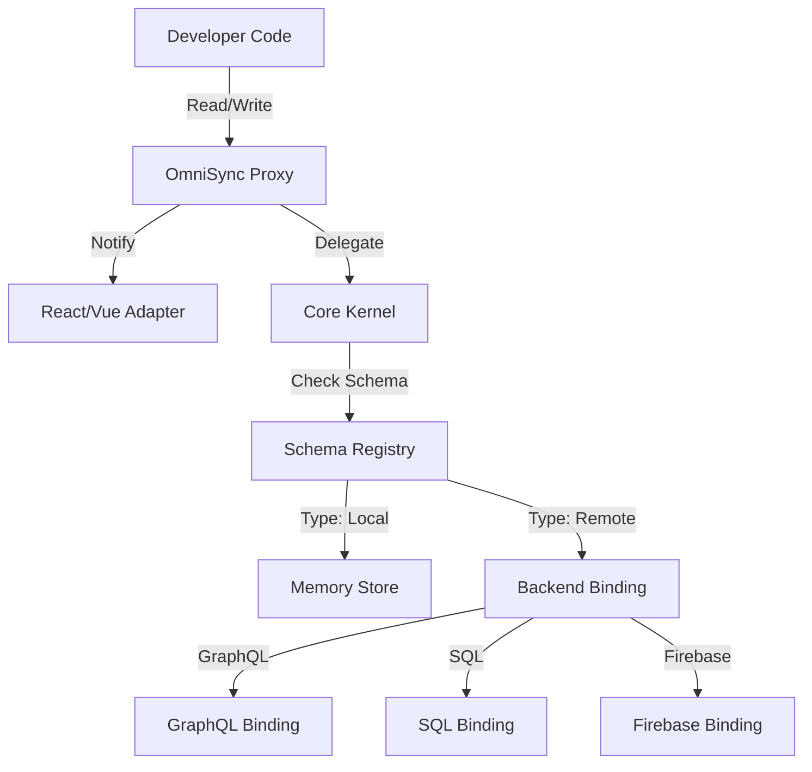

# OmniSync: Technical Architecture & Implementation Blueprint

**Date:** 2025-11-27
**Status:** Blueprint (Ready for Implementation)
**Goal:** Define the architecture of **OmniSync**, a unified state management library that decouples *State Logic* (how components read/write data) from *State Storage* (where data lives).

---

## 1. Architectural Overview

OmniSync is built on a **Kernel + Adapter** architecture.
The core library ("The Kernel") handles reactivity, proxying, and lifecycle management. It knows nothing about GraphQL, SQL, or Firebase.
All data fetching and persistence is delegated to **Backend Bindings**.



---

## 2. The Core Kernel

The Kernel is responsible for creating the illusion of synchronous, mutable state.

### 2.1. The Proxy Structure & Cache
The Kernel uses a **Normalized Cache** strategy to handle the "Split Brain" problem (Server vs Client view).

**Internal Structure:**
```typescript
{
  // 1. Entities: The "Truth" (Keyed by ID)
  entities: {
    "user:1": { id: 1, name: "Alice", role: "admin" },
    "todo:a": { id: "a", title: "Buy Milk", completed: false }
  },
  
  // 2. Queries: The "Views" (Keyed by Query Hash)
  queries: {
    'todos:{"completed":false}': ["todo:a"],
    'todos:{"completed":true}': []
  },
  
  // 3. Promises: In-flight requests (Keyed by Query Hash)
  promises: {
    'todos:{"completed":false}': Promise<...>
  }
}
```

**Responsibilities:**
1.  **Traps `get`**:
    *   **Lazy Proxying:** Only create proxies when accessed.
    *   **Stable Identity:** `state.todos.where(...)` returns the *same* Proxy instance if the query hash is identical.
    *   **Suspense:** If a query is in `promises` but not `queries`, throw the *same* Promise instance to avoid loops.
2.  **Traps `set`**:
    *   **Optimistic Update:** Update the `entities` cache immediately.
    *   **Predicate Matching:** Scan active `queries`. If the modified entity no longer matches a query's criteria (e.g., `completed` changed to `true`), remove it from that query's list *instantly*.
    *   **Notify:** Trigger React updates for affected components.

### 2.2. The Meta Side-Channel
To avoid polluting the data object with `isLoading` or `error` fields, we use a Symbol-based side-channel.

```typescript
export const META = Symbol('OmniSyncMeta');

export interface MetaState {
  status: 'idle' | 'loading' | 'error' | 'ready';
  error: Error | null;
  lastUpdated: number;
  isDirty: boolean; // True if optimistic update hasn't been confirmed
}

// Helper
export function meta(node: any): MetaState {
  return node[META];
}
```

---

## 3. The Backend Binding System

This is the extension point that allows OmniSync to support GraphQL, SQL, Firebase, or any other backend.

### 3.1. The Binding Interface
Every backend adapter must implement this interface:

```typescript
export interface BackendBinding<T = any> {
  // 1. READ: Fetch a single item or list
  read(query: QueryRequest): Promise<T>;
  
  // 2. WRITE: Mutate data
  write(mutation: MutationRequest): Promise<void>;
  
  // 3. SUBSCRIBE: Listen for realtime updates
  subscribe(query: QueryRequest, onUpdate: (data: T) => void): UnsubscribeFn;
  
  // 4. QUERY BUILDER: Generate backend-specific query strings/objects
  buildQuery(collection: string, options: QueryOptions): QueryRequest;
}

export interface QueryRequest {
  // Opaque object understood by the specific binding
  // e.g., for GQL: { query: string, variables: object }
  // e.g., for SQL: { sql: string, params: any[] }
}

export interface QueryOptions {
  where?: Record<string, any>;
  orderBy?: Record<string, 'asc' | 'desc'>;
  limit?: number;
  offset?: number;
  pk?: string | number; // Primary Key lookup
}
```

### 3.2. Standard Bindings

#### A. GraphQL Binding (Default)
*   **Read:** Generates `query { table(where: ...) { ... } }`.
*   **Write:** Generates `mutation { update_table_by_pk(...) { ... } }`.
*   **Subscribe:** Generates `subscription { ... }`.
*   **Config:** Requires `endpoint` and `headers` (or an Apollo Client instance).

#### B. SQL Binding (via API)
*   **Read:** Generates `SELECT * FROM table WHERE ...`.
*   **Write:** Generates `UPDATE table SET ...`.
*   **Transport:** Sends the SQL string to a secure API endpoint (e.g., `/api/sql-runner`).

#### C. Firebase Binding (Future)
*   **Read:** `getDoc(doc(db, col, id))`.
*   **Subscribe:** `onSnapshot(...)`.

---

## 4. The Query Builder API

To support efficient fetching (avoiding `SELECT *`), we use a **Collection Proxy** pattern.

**Usage:**
```typescript
// 1. Select by PK
const item = state.todos.get('uuid-123');

// 2. Filter & Sort
const list = state.todos
  .where({ status: 'active' })
  .orderBy({ created_at: 'desc' })
  .limit(10);
```

**Implementation:**
*   `state.todos` is a `CollectionProxy`.
*   **Memoization:** Calling `.where()` generates a deterministic hash (e.g., `todos:{"status":"active"}`). If a proxy for this hash exists, return it. This ensures referential stability for React `useEffect`.
*   **Client-Side Filtering:** When reading the list, the Kernel applies the filter to the *cached entities* to ensure the UI reflects optimistic updates immediately, even before the server confirms.

---

## 5. Schema Definition & Registry

The Registry tells the Kernel which Binding to use for which part of the state tree.

**File:** `src/state/schema.ts`
```typescript
import { defineState, GraphQLBinding, SQLBinding } from 'omnisync';

export const appState = defineState<AppState>({
  // 1. Local State (No binding = Memory)
  ui: {
    sidebarOpen: false,
    theme: 'dark'
  },
  
  // 2. GraphQL State
  todos: {
    _binding: new GraphQLBinding({ table: 'todos' }),
    // No runtime overhead, just TS inference
  },
  
  // ...
});

// Helper type to infer the shape
type AppState = {
  ui: { sidebarOpen: boolean; theme: string };
  todos: Todo[];
  analytics: Event[];
};
```

---

## 6. Implementation Plan (For AI Agents)

This project should be implemented in the following order:

### Phase 1: The Kernel (Pure TS)
1.  **`createProxy`**: Implement the recursive proxy trap for `get`/`set`.
2.  **`Subscribable`**: Implement a lightweight event emitter for value changes.
3.  **`Suspense`**: Implement the "throw Promise if loading" logic.

### Phase 2: The React Adapter
1.  **`useOmni`**: Implement the hook that forces re-renders when the Proxy emits a change event.
2.  **`ErrorBoundary`**: Ensure errors from the Proxy are caught gracefully.

### Phase 3: The Bindings
1.  **`GraphQLBinding`**: Implement a basic string-concatenation GQL generator.
2.  **`SQLBinding`**: Implement a basic SQL generator.

### Phase 4: The Query Builder
1.  **`CollectionProxy`**: Implement `.where()`, `.orderBy()`, `.limit()` chaining.

---

## 7. Example Usage (The "Dream" Code)

```tsx
import { useOmni } from 'omnisync';

function TodoList() {
  const state = useOmni();
  
  // 1. Query Construction (Synchronous, no fetch yet)
  const activeTodos = state.todos
    .where({ completed: false })
    .orderBy({ created_at: 'desc' });
    
  // 2. Data Access (Triggers Suspense if loading)
  return (
    <div>
      {activeTodos.map(todo => (
        <TodoItem key={todo.id} todo={todo} />
      ))}
    </div>
  );
}

function TodoItem({ todo }) {
  // 3. Mutation (Optimistic update + DB write)
  const toggle = () => {
    todo.completed = !todo.completed;
  };
  
  return <input type="checkbox" checked={todo.completed} onChange={toggle} />;
}
```

---

## 8. Write Strategies (Optimistic vs Pessimistic)

By default, OmniSync is **Optimistic**: assignments update the UI immediately.
To opt-out (e.g., for critical actions requiring server confirmation), we use a **Transaction Context**.

### API: `Omni.write()`

```typescript
import { Omni } from 'omnisync';

// 1. Default (Optimistic)
// UI updates instantly. Background sync.
state.todo.title = 'New Title';

// 2. Pessimistic (Wait for Server)
// UI does NOT update until server responds.
await Omni.write(() => {
  state.todo.title = 'New Title';
}, { optimistic: false });
```

### Mechanism:
1.  `Omni.write` sets a global `TransactionContext` flag.
2.  The Proxy `set` trap checks this flag.
3.  If `optimistic: false`:
    *   **Skip** the immediate cache update.
    *   Trigger `binding.write()`.
    *   Wait for the binding to return the confirmed value.
    *   Update the cache with the *server* response.
4.  `Omni.write` returns a Promise that resolves when all triggered mutations complete.

This approach preserves the clean assignment syntax while providing granular control.

### Solution: Dynamic Context Injection
Backend bindings accept a `headers` or `context` function in their constructor. This function is called before every request.

```typescript
// src/state/schema.ts

const gqlBinding = new GraphQLBinding({
  endpoint: process.env.NEXT_PUBLIC_API_URL,
  // Dynamic header injection
  headers: async () => {
    // Integrate with your auth provider (NextAuth, Firebase Auth, etc.)
    const token = await getAuthToken(); 
    return {
      'Authorization': `Bearer ${token}`,
      'X-Hasura-Role': 'user'
    };
  }
});

export const appState = defineState({
  todos: {
    _binding: gqlBinding,
    _type: [] as Todo[]
  }
});
```

**Mechanism:**
1.  The Kernel triggers `binding.read()`.
2.  The Binding calls the `headers()` function.
3.  The Binding waits for the promise to resolve (handling token refresh if needed).
4.  The Binding executes the request with the fresh headers.

## 9. Cache Strategy (Stale-While-Revalidate)

**Q: What happens when a new component mounts and requests existing data?**
**A: Stale-While-Revalidate.**

To ensure the UI is instant but eventually consistent:
1.  **Immediate Return:** If the query hash exists in `queries` cache, return it immediately.
2.  **Background Refetch:** If the data is considered "stale" (default: > 0ms), trigger a background `binding.read()`.
3.  **Update:** When the new data arrives, update the cache and trigger a re-render.

**Configuration:**
```typescript
export const appState = defineState({
  todos: {
    _binding: gqlBinding,
    _options: {
      staleTime: 5000, // Data is fresh for 5s (no refetch)
      refetchOnMount: true // Always check server on new component mount
    }
  }
});
```

This prevents the "Stale Data" issue (User 2's changes not appearing) while maintaining the "Instant Load" feel.

## 10. Realtime Subscriptions

**Q: How do we enable live updates from the DB?**
**A: Configuration in `defineState`.**

You can enable realtime syncing globally for a collection or per-query.

### Configuration
```typescript
export const appState = defineState({
  todos: {
    _binding: gqlBinding,
    _options: {
      // Enable WebSocket subscriptions for ALL queries on this collection
      sync: true 
    }
  }
});
```

### Mechanism
1.  If `sync: true`, the Kernel calls `binding.subscribe()` instead of `binding.read()`.
2.  The Binding maintains an active WebSocket connection.
3.  When a new event arrives, the Binding calls the `onUpdate` callback.
4.  The Kernel updates the cache and triggers re-renders.

This allows you to switch between "Pull" (Query) and "Push" (Subscription) modes without changing a single line of component code.

## 11. Next Steps

1.  **Prototype the Kernel:** Build the basic Proxy + `useOmni` hook.
2.  **Test Suspense:** Verify that throwing promises from a Proxy works as expected in React.
3.  **Build the "Todo" Proof-of-Concept:** A simple app with one local state and one "mocked" remote state.
